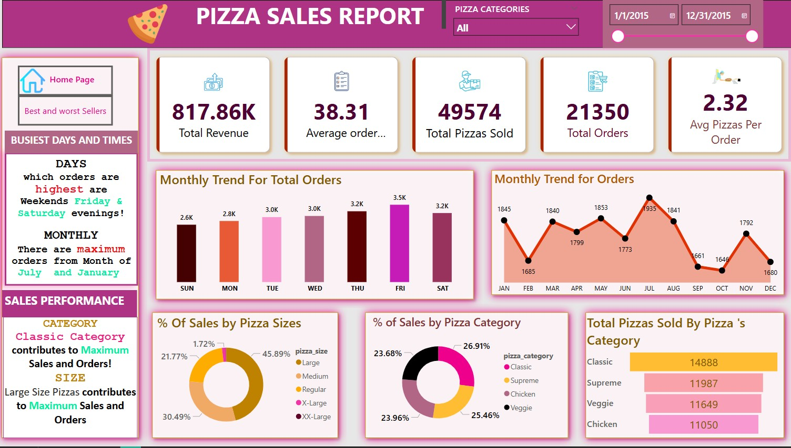

# 🍕 Power BI Pizza Sales Dashboard with MySQL & Excel

A comprehensive business intelligence project that uses Power BI, MySQL, and Excel to uncover insights from pizza sales data. This dashboard visualizes real-world business KPIs such as revenue trends, top-selling items, customer preferences, and performance breakdowns — helping drive smarter decisions in the food retail industry.

---

##  Table of Contents

##  Table of Contents

1. [Project Overview](#project-overview)
2. [Data Sources](#data-sources)
3. [Tools Used](#tools-used)
4. [Data Cleaning & Preparation](#data-cleaning--preparation)
5. [Dashboard Features](#dashboard-features)
6. [Key Metrics & DAX Measures](#key-metrics--dax-measures)
7. [Screenshot](#screenshot)
8. [Results](#results)
9. [Recommendations](#recommendations)
   


---

##  Project Overview

This project focuses on analyzing pizza sales data to extract valuable insights about sales performance, product popularity, order behavior, and business trends using a combination of SQL, Excel, and Power BI.

---

##  Data Sources

- `pizza_sales.csv`: Raw transactional data of pizza orders  
- SQL queries: Used to clean and analyze data in MySQL  
- Power BI: Used to connect data sources and build visuals  

---

## Tools Used

- **Power BI** – Data visualization
- **MySQL** – Data transformation and querying
- **Excel** – Raw data inspection
- **DAX** – Calculated columns & KPIs

---

##  Data Cleaning & Preparation

Performed in **MySQL** and **Power BI Power Query Editor**:
- Removed nulls and duplicates
- Parsed date columns
- Standardized categories and size values
- Aggregated data by time, pizza name, size, and category

---

## Dashboard Features

- KPI Cards: Total Revenue, Total Orders, Average Order Value, Total Pizzas Sold
- Charts: Daily/Monthly Orders, Category & Size Breakdown, Best/Least Selling Pizzas
- Slicers: Pizza Category, Size, Date Range, Pizza Name
- Tooltips, drill-throughs, and interactive filters

---

##  Key Metrics & DAX Measures

Examples:
```dax
-- Total Revenue
Total Revenue = SUM(pizza_sales[total_price])

-- Average Order Value
Average Order Value = DIVIDE(SUM(pizza_sales[total_price]), DISTINCTCOUNT(pizza_sales[order_id]))

-- % Sales by Category
% Sales by Category = 
    DIVIDE(SUM(pizza_sales[total_price]), CALCULATE(SUM(pizza_sales[total_price]), ALL(pizza_sales[category])))
```

*Full list in `dax_measures.txt`.*

---

##  Screenshot




---

## 📈 Results

-  Revenue is highest during weekends and in large-sized pizzas
-  Top-selling pizzas include BBQ Chicken, Pepperoni Classic, and Deluxe
-  Medium and Large sizes dominate sales
-  Sales peak around lunchtime and dinner hours
-  Certain pizza categories underperform consistently (e.g., Veggie Lovers)

---

## 📝 Recommendations

- Promote best-selling pizzas with combo offers
- Target promotions around peak lunch/dinner hours
- Introduce limited-time offers for underperforming pizzas
- Offer loyalty rewards for customers ordering large sizes
- Use time-based analysis to optimize staffing and operations

---


